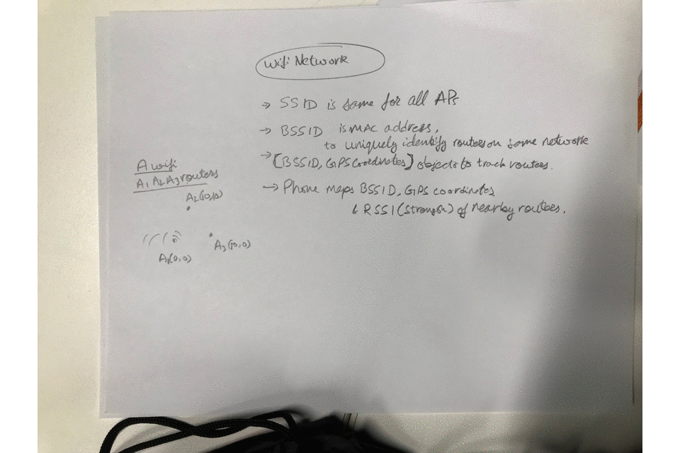

# sweetWifi, Hackcooper Hackathon 2018

**team members**: Ehson Assani (project lead), Tahfimul Latif(lead programmer), Pushkar Sharma(assistant programmer), Anran Li(UX lead)

## Our Goal

### 
Have you ever stayed at a place where the wifi seemed to have a mind of its own?  As in, if you stand directly near the coffee table, the wifi works, but take 10 steps forward and no more wifi.  Now if you had our app sweetWifi, it would automatically connect to another wifi connection for you, all while you go about your business.

    

*This demo was created at the very last moment by Anran Li*

## The how's and why's
SweetWifi works primarily through crowdsourced data, it's how Waze app works on your mobile phone.  After you login your credentials to your account, we will store your location and all wifi connections that you have access to (if it is a private connection, as long as you have logged in through the app, we will remember it for you).  Then through our online database (we would choose Amazon DynamoDB as Amazon would handle all the upkeep), we would automatically swap connections for you based on our algorithm.  The algorithm would look at our database for a list of past changes in router strength, the time of day the strength is at it's worst and for how long, current strength of nearest routers and then give each router a score.  It's main priority is to choose reliability, secondary would be fastest connection near you.

### Results:

Although we did not win any awards, we definitely learned valuable lessons to apply next time (I was fortunate enough to win my next hackathon at HackAttack QC).  Primarily we were new to android studio, online databases and how they should work, time constraints were as real as ever (24 hour hackathon) and coming up with ideas that would work.

    

